# IBM MQ NativeHA on RHEL

---

# Table of Contents
- [1. Introduction](#introduction)
- [2. Workshop Environments ](#workshop-env)
- [3. IRR Setup](#live-setup)
  * [3a. acemq1 - Create Live Queue Manager ](#create-live-qm)
  * [3b. acemq4 - Create Recovery Queue Manager](#create-recovery-qm)
  * [3c. acemq1 - Create TLS Certificates](#tls-setup-live)
  * [3d. acemq4 - Update Certificate Permissions](#tls-setup-recovery)
  * [3e. acemq1 - Update Live qm.ini](#update-live-qm-ini)
  * [3f. acemq4 - Update Recovery qm.ini ](#update-recovery-qm-ini)
  * [3g. acemq1, acemq4 - Enable systemd Monitoring](#enable-systemd)  
  * [3h. Disable Security](#disable-security)
- [4. Testing In-Region Replication in Live Environment](#testing-irr)
  * [4a. Put and Get messages (amqsphac, amqsghac)](#ha-put-get)
- [5. Switching Roles](#switch-roles)
- [6. Summary ](#summary)

---
[Return to Main Menu](../index.md)
<br>

## 1. Introduction <a name="introduction"></a>

**What is Native HA?** <br>
Native HA is a high availability solution that is available on container deployments of IBM® MQ and on Linux.

**What is Native HA In-Region Replication (IRR)?** <br>
A Native HA In-Region Replication (IRR) configuration enables you to switch the running of a queue manager to a different Native HA configuration in a different location within the same region.

**In this lab**, you will investigate the process of configuring the NativeHA In-Region Replication (IRR) Queue Manager on RHEL Virtual Machines. Additionally, you will conduct testing in the Live environment, subsequently performing a failover to the Recovery environment and monitoring the transition of client connections from Live to Recovery.
.

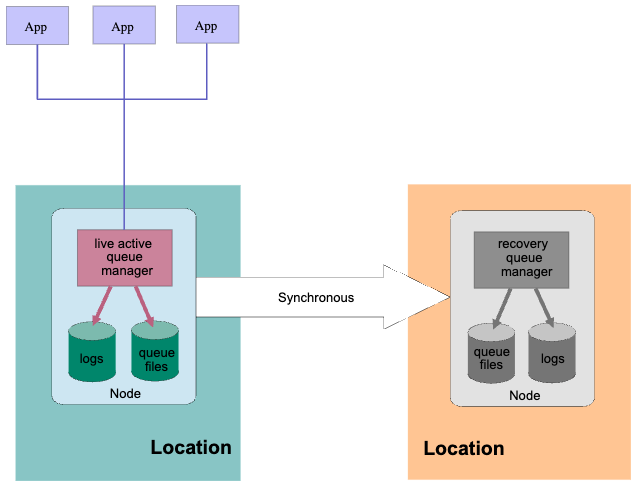

<br>

## 2. Workshop Environments  <a name="workshop-env"></a>

You need to reserve Techzone environment which will have 6 RHEL VMs, and 1 WIndows VM. <br>
For this lab we will be using acemq1 and acemq4 for doing the MQ native HA IRR. <br>
We will launch everything from the Windows image.

Click on the Windows image console to open it.

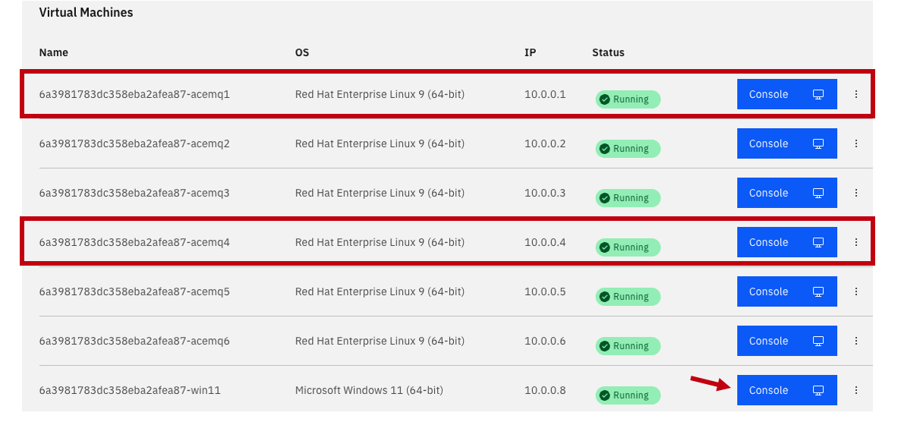

<br>


## 3. IRR Setup <a name="live-setup"></a>

1. From the Windows console click on the **CAD** to get to the login page.  Click on OK for the Business Use Notice

   

1. Login to the windows using techzone/IBMDem0s

   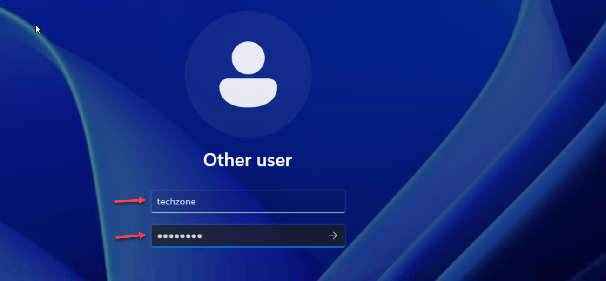

1. From the Windows VM's Console, open Putty program and open acemq1, acemq4 Virtual Machine sessions. <br>

   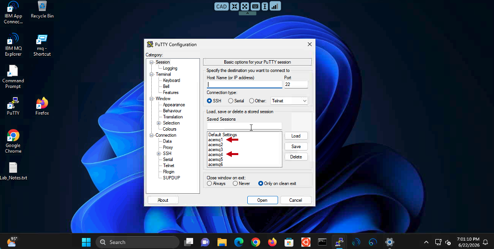


1. Arrange the windows on your desktop and you should have the 3 RH vms.    Login to each VM using ibmuser/engage.

   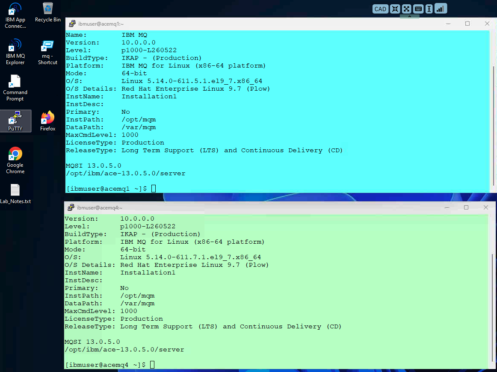
   
<br>

### 3a. acemq1 - Create Live Queue Manager <a name="create-live-qm"></a>

1. Run the following commands <br>

   Create Queue Manager MQ01IR <br>
   ```
   crtmqm -lr `hostname` -lf 8192 -lp 10 -ls 10 -p 1414 MQ01IR
   ```
   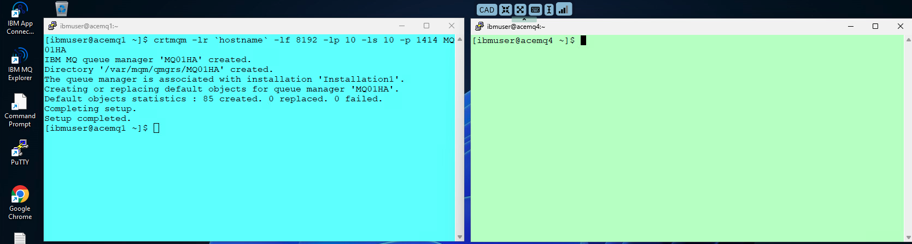

<br>

### 3b. acemq4 - Create Recovery Queue Manager <a name="create-recovery-qm"></a>

1. Run the following commands <br>

   Create Queue Manager MQ01IR on the Recovery side <br>
   ```
   crtmqm -lr `hostname` -lf 8192 -lp 10 -ls 10 -p 1414 MQ01IR
   ```
   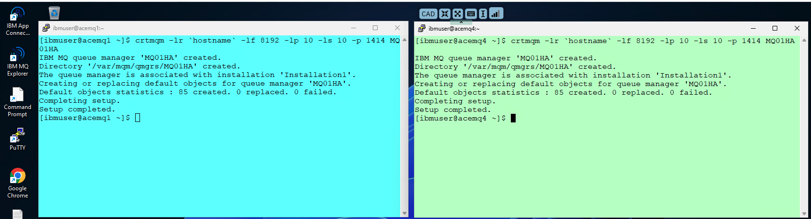

<br>


### 3c. acemq1 - Create TLS Certificates <a name="tls-setup-live"></a>

1. Run the below steps to enable TLS on Queue Manager.  <br>
 
   Create TLS certificates. <br>
   ```
   runmqakm -keydb -create -db /var/mqm/qmgrs/MQ01IR/ssl/key.kdb -pw passw0rd -stash
   ```
   
   ```
   runmqakm -cert -create -db /var/mqm/qmgrs/MQ01IR/ssl/key.kdb -pw passw0rd -label selfsigned -dn CN=MQ01IR -size 2048
   ```
   
   ```
   sudo chown -R :mqm /var/mqm/qmgrs/MQ01IR/ssl/key.*
   ```
   ```
   sudo chmod g+r /var/mqm/qmgrs/MQ01IR/ssl/key.*
   ```

   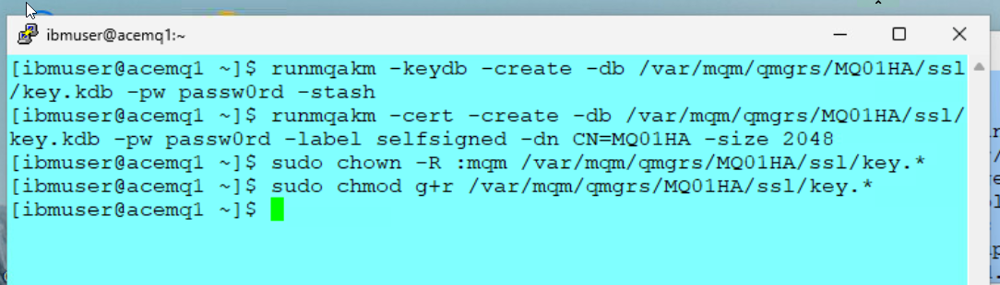


2. Copy all key.* files to acemq4 (Recovery) Virtual Machines using sftp. 

   ```
   sftp ibmuser@acemq4
   ```
   ``` 
   mput /var/mqm/qmgrs/MQ01IR/ssl/key.* /var/mqm/qmgrs/MQ01IR/ssl
   ```
   ```
   quit
   ```

   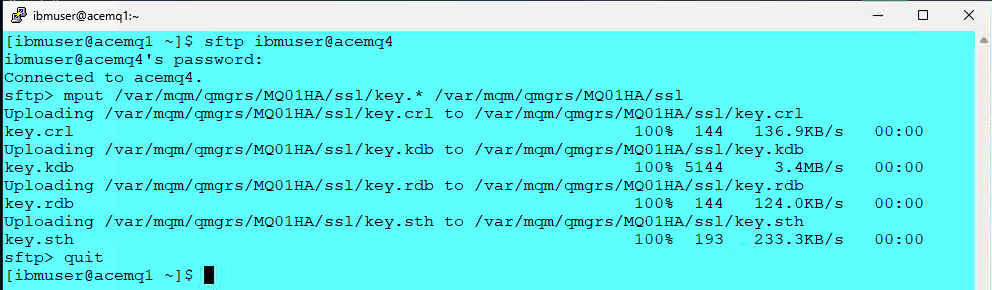


### 3d. acemq4 - Update Certificate Permissions  <a name="tls-setup-recovery"></a>

1. Run the following commands to grant access to key.* files. <br>
   ```
   sudo chown -R :mqm /var/mqm/qmgrs/MQ01IR/ssl/key.*
   ```
   ```
   sudo chmod g+r /var/mqm/qmgrs/MQ01IR/ssl/key.*
   ```
   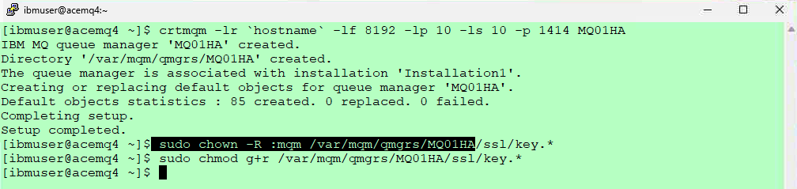

   <br>


### 3e. acemq1 - Update Live qm.ini <a name="update-live-qm-ini"></a>

1. On VM acemq1, we will add the TLS parameters, NativeHARecoveryGroup stanza to qm.ini. 

   You can run the following command to look at the current **qm.ini** file.

   ```
   cat /var/mqm/qmgrs/MQ01IR/qm.ini
   ```
   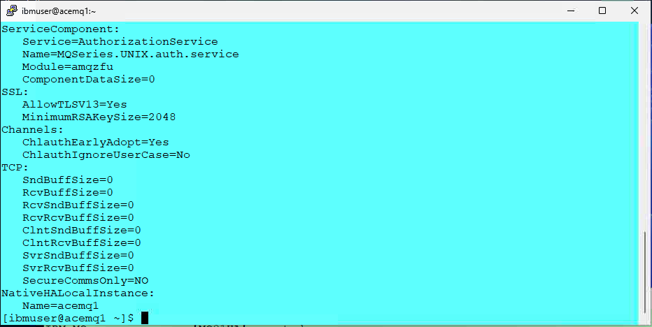

   
1. run the following commands. <br>

   ```
   cd ~/mqha-irr
   ```

   Run 1-qm-IRR.sh to enable Native HA IRR on the Live Region. The command will add Native HA configurations to qm.ini file.<br>

   ```
   ./1-qm-IRR.sh
   ```

   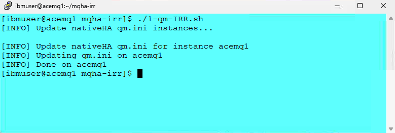

   <br>

1. When done run the following command to verify that the **qm.ini** was updated correctly. 

   ```
   cat /var/mqm/qmgrs/MQ01IR/qm.ini
   ```

   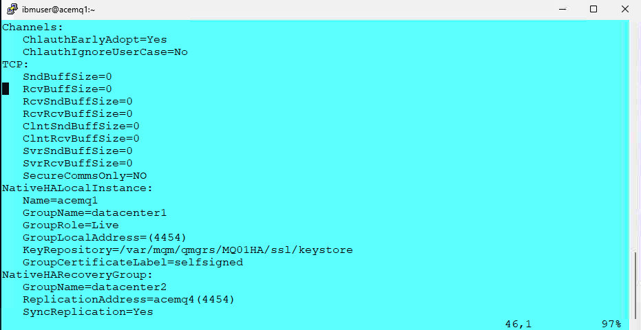

   <br>


### 3f. acemq4 - Update Recovery qm.ini <a name="update-recovery-qm-ini"></a>

1. Run 2-qm-IRR.sh to enable Native HA IRR on the Recovery Region. The command will add Native HA configurations to **qm.ini** file.<br>

   ```
   ./2-qm-IRR.sh
   ```
   Check qm.ini. <br>
   ```
   cat /var/mqm/qmgrs/MQ01IR/qm.ini
   ```
   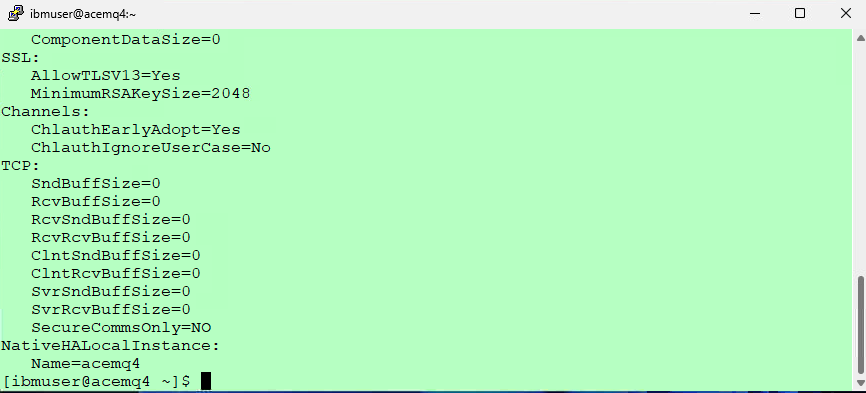

   
1. Run below commands. <br>

   ```
   cd ~/mqha-irr
   ```
   
   Enable Native HA IRR. <br>
   ```
   ./2-qm-IRR.sh
   ```
   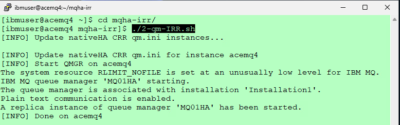


1. When done run the following command on acemq4 instance to verify that the **qm.ini** was updated correctly. 

   ```
   cat /var/mqm/qmgrs/MQ01IR/qm.ini
   ```

   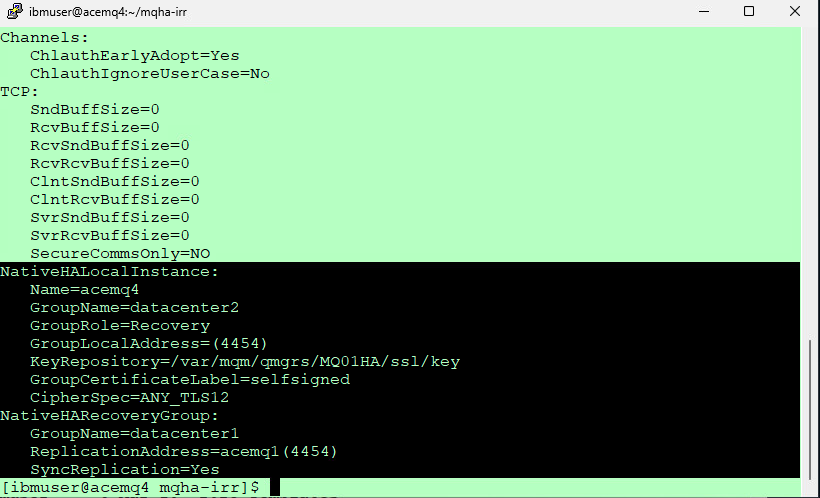

   <br>


### 3g. acemq1, acemq4 - Enable systemd Monitoring  <a name="enable-systemd"></a>

1. Reference: <br>
https://www.ibm.com/docs/en/ibm-mq/9.4.x?topic=ha-monitoring-restarting-ending-queue-manager-instances
<br>

   You can implement a method to ensure that the queue manager instances in the Native HA configuration are still running, and restart them if required. <br><br>


1. Run the following commands on each RHEL VM. <br>

   ```
   ln -s /opt/mqm/samp/mqmonitor@.service /etc/systemd/system 
   ````
   ```
   sudo systemctl enable mqmonitor@MQ01IR
   ```
   ```
   sudo systemctl start mqmonitor@MQ01IR
   ```
   <br>


   The Queue Manager should be active in one of Virtual Machines. <br>

   ```
   dspmq -o nativeha -x
   ```
   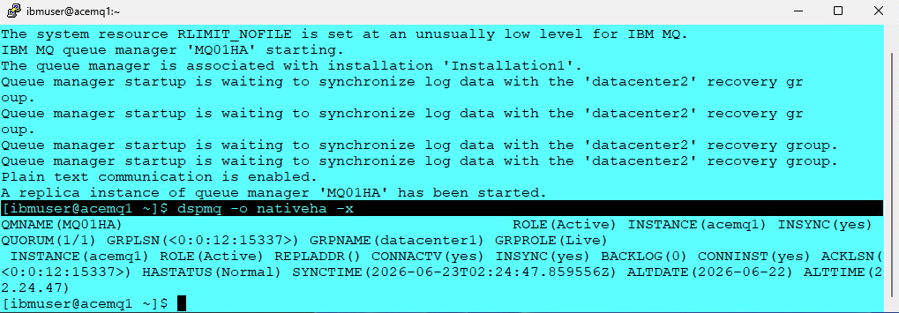


### 3h. Disable Security <a name="disable-security"></a>


Run the following command, on the node where the queue manager is Active, <br>
This will disable security and define the channel and local Queue used for testing. 

   ```
   runmqsc MQ01IR
   ALTER QMGR CHLAUTH(DISABLED) CONNAUTH(' ')
   REFRESH SECURITY TYPE(CONNAUTH)
   DEFINE CHANNEL(NATIVEHACHL.SVRCONN) CHLTYPE(SVRCONN)
   DEFINE QLOCAL(APPQ) DEFPSIST(YES)
   quit

   ```


   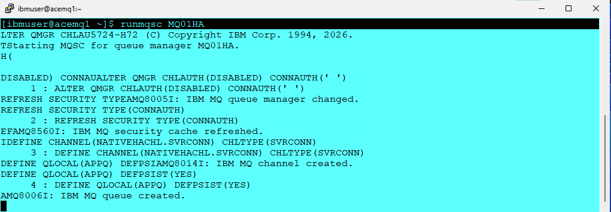

   <br>

## 4. Testing In-Region Replication in Live Environment <a name="testing-irr"></a>

### 4a. Put and Get messages (amqsphac, amqsghac)  <a name="ha-put-get"></a>


1. **On the Windows VM Desktop** <br> 
   Open the **MQ-Labs** folder and start the **putter and getter** batch files. <br>

   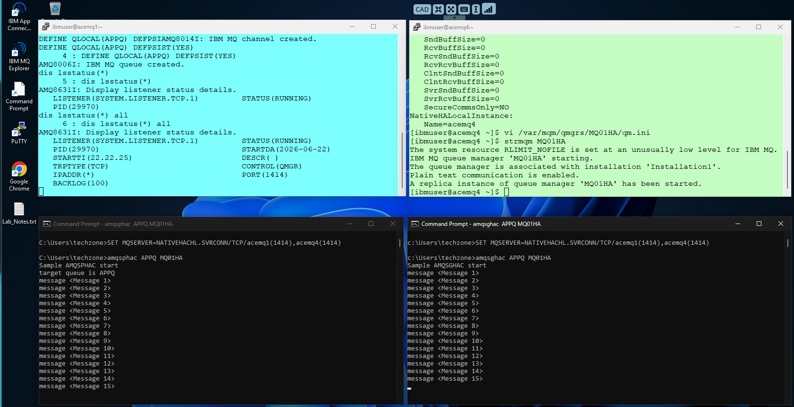

   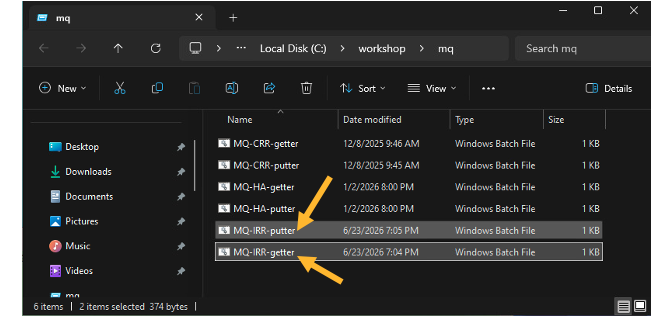

   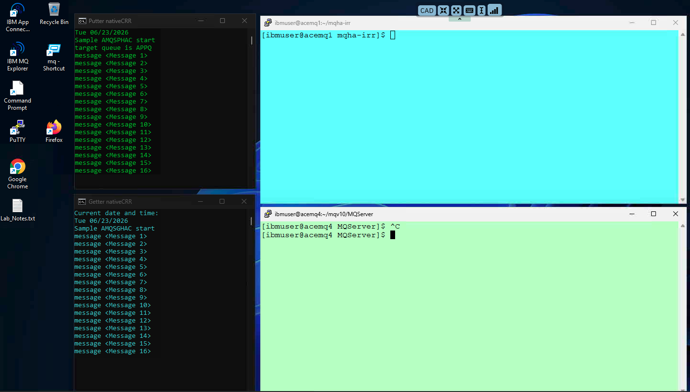


<br>


## 5. Switching Roles  <a name="switch-roles"></a>

1. We will now check the status on both Datacenter deployments. If this is the first time you should see **Datacenter1 - Live** and **Datacenter2 - Recovery**

   **acemq1**
   ```
   ./get-status.sh 
   ```
   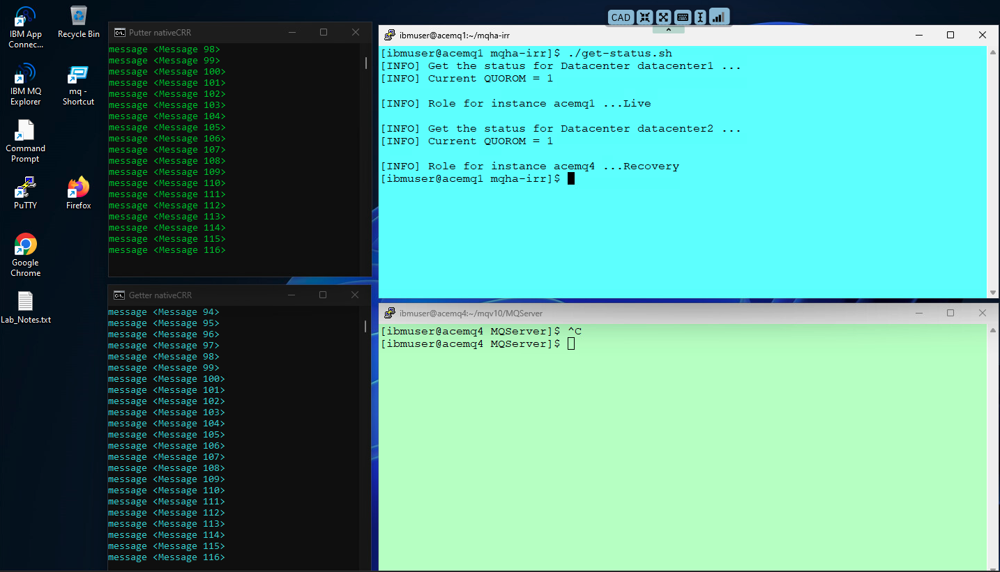


   Let's switch roles, which will make the Live to be Recovery and Recovery to be Live. <br>

   ```
   ./3-switch-irr.sh
   ```

   You will also observe that the putter and getter programs will reconnect to the new active instance of the QMgr.

   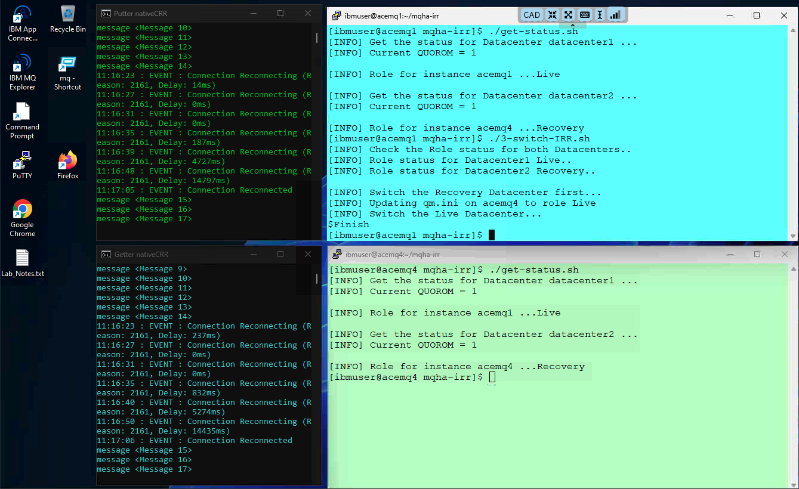
   
   <br> 

1. You can now run the ./get-status.sh again to see current status and then the ./5-switch-crr.sh to switch roles back. 
 
   ```
   ./get-status.sh
   ```

   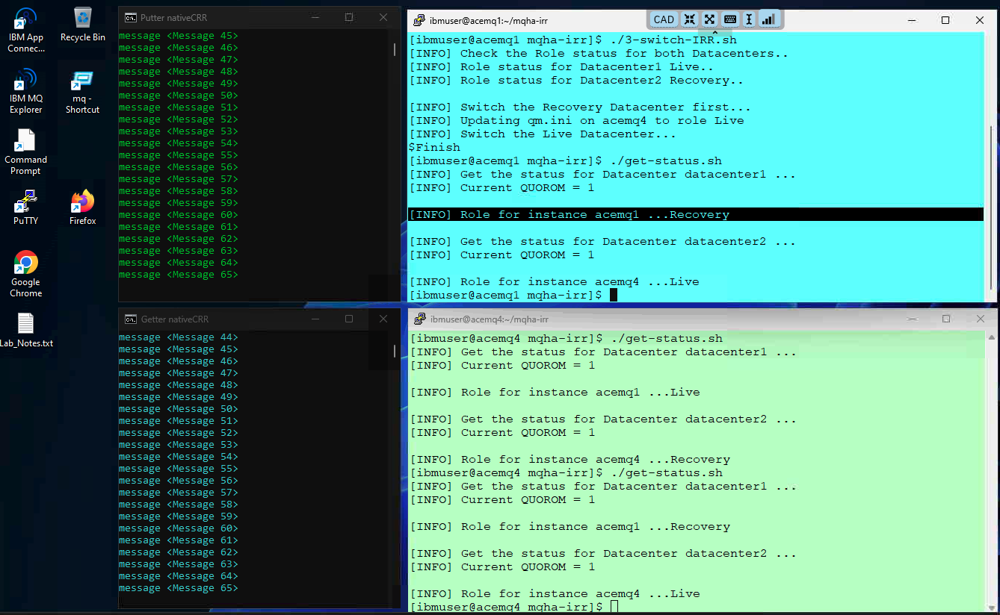

1. Now, you can switch the roles back by running ./3-switch-CRR.sh to failover back to the Live data center. <br>
   ```
   ./3-switch-irr.sh
   ```

   <br>

## 5. Summary <a name="summary"></a>

Congratulations! At this point, you ought to be familiar with the process of configuring IBM MQ Native HA IRR in the Primary, and Recovery regions.

   
<br>
[Return to Main Menu](../index.md)


