# MQ Open telemetry Tracing with Jaeger


## 1. Overview

In this lab, we will explore how to capture and send MQ Open Telemetry traces to Jaeger user interface. Jaeger is an open-source distributed tracing tool to monitor and troubleshoot MQ transactions. <br>

**Lab environment:** <br>
Platform: RHEL Linux VM <br>
Jaeger Runtime: Podman <br>

<br>


## 2. Installing Jaeger

Let's install & run Jaeger as a podman container. Assuming the RHEL VM already has podman installed.
 <br>

```
# install crun if not already installed. crun is a fast and lightweight OCI (open container initiative) runtime.

sudo yum install crun

podman run -d --restart unless-stopped --name jaeger -p 16686:16686 -p 4317:4317 quay.io/jaegertracing/all-in-one:latest

# Check if Jaeger container is running
podman ps
```

Open Jaeger console http://localhost:16686
<br>

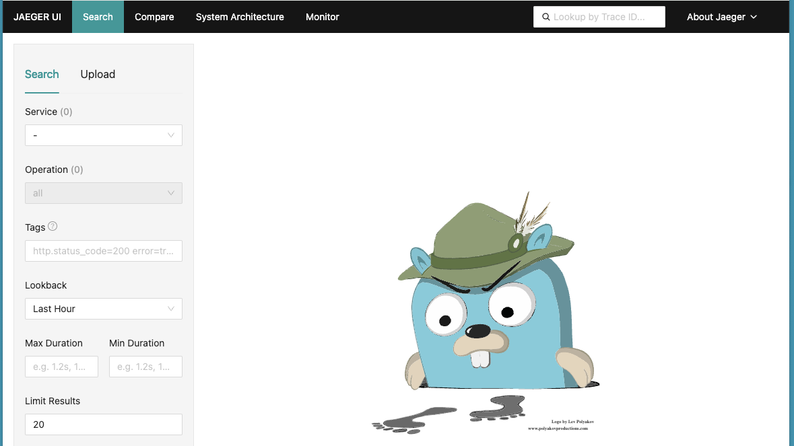

<br><br>


## 3. Install MQ OTEL Tracing libraries into /var/mqm/exits64

Download MQ OTEL Tracing libraries from [<b><u>here</u></b>](./resources/ibm-mq-tracing-exits_xLinux_64bit.zip)</b>

Use unzip commands to extract files. <br>

```
sudo unzip ibm-mq-tracing-exits_xLinux_64bit.zip -d /var/mqm/exits64

sudo chown mqm:mqm /var/mqm/exits64
```

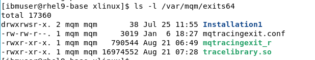

<br><br>


## 4. Update mqs.ini

IBM MQ Tracing uses an IBM MQ user exit to trace IBM MQ messages.<br>

Append below stanza to /var/mqm/mqs.ini file. <br>

```
sudo vi /var/mqm/mqs.ini

ApiExitCommon:
  Sequence=100
  Function=EntryPoint
  Module=/var/mqm/exits64/mqtracingexit
  Name=TracingApiExit
```
<br><br>


## 5. Create Queue Manager

```
# Create a queue manager
crtmqm OTEL

# Start the queue manager
strmqm OTEL

# Create a test queue
echo "define qlocal(AA)" | runmqsc OTEL
```

<br><br>


## 6. Testing - Exploring Tracing

Lets use amqsput, and amqsget sample programs to put & get messages to AA queue. <br>

```
*** Open first Terminal window.

# Put one message
/opt/mqm/samp/bin/amqsput AA OTEL

*** Open second terminal window.

# Get message
/opt/mqm/samp/bin/amqsget AA OTEL

```
Now, from the first terminal window enter a message. <br>

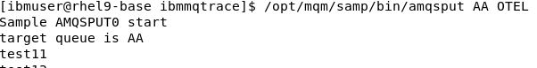


Open Jaeger console in browser and check the generated traces. <br>
http://localhost:16686
<br>

Select OTEL Queue Manager from the Service dropdown field. <br>

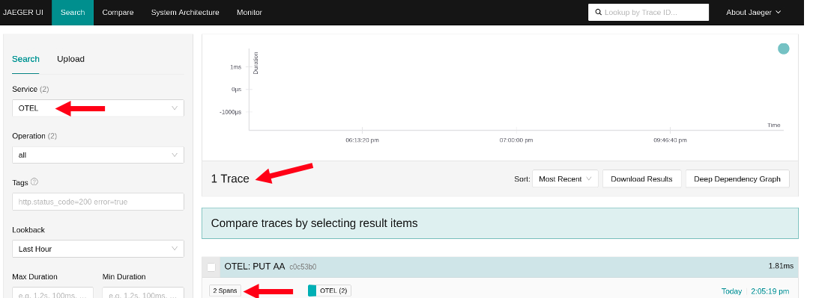

Click by the ‘2 spans’ and some more details are presented. <br>

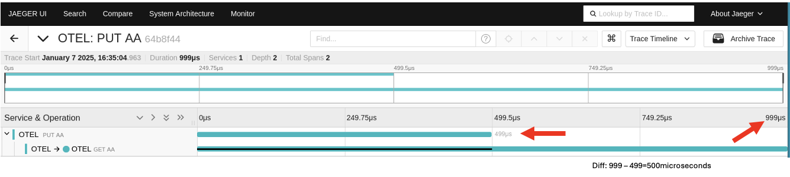

Notice the PUT part runs from 0 to 499 microseconds and the GET does nothing ( black line) until 499 microseconds.<br>

The trace is indicating that in this scenario (with a ‘getting’ program in place to immediately process anything that arrives on queue AA) the time taken to put the message on the queue is 499 microseconds and the time taken to retrieve the message from the queue was about .500 microseconds ( the difference between 499 microseconds and 999 microseconds).
<br>

You can click on the individual lines in the Jaeger UI to get more details
<br>

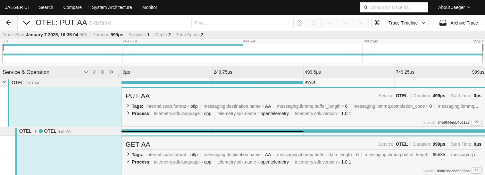

<br>


## 7. Exploring trace logs

When the tracing exits and configuration file were installed, the file mqtracingexit.conf set a value of LOG_LEVEL="info". This is requesting a basic log file. <br>

Check /tmp a notice a new folder has been created /tmp/ibmmqtrace, and contains some mqExit.xxx.log files. Look at one of the log files.
<br>

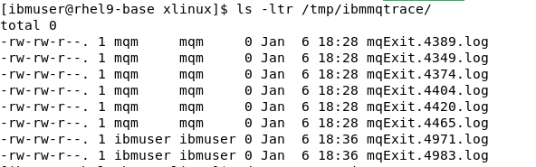

<br>

Let's change the LOG_LEVEL to 'debug'. <br>

Update /var/mqm/exits64/mqtracingexit.conf file. <br>

```
sudo vi /var/mqm/exits64/mqtracingexit.conf

LOG_LEVEL='debug'
```

Restart the Queue Manager. <br>
```
endmqm OTEL
strmqm OTEL
```

Put a test message. <br> 

```
/opt/mqm/samp/amqsput AA OTEL 
```

Now check the logs under /tmp/ibmmqtrace folder. Check the latest log file. You should see debug traces getting created like below.<br>

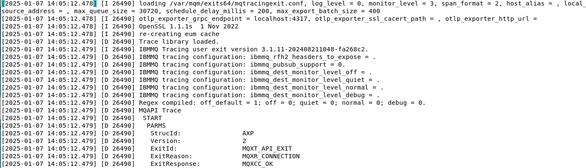

Scroll down until you see mqttax.spanctx which shows the span identifier. <br>

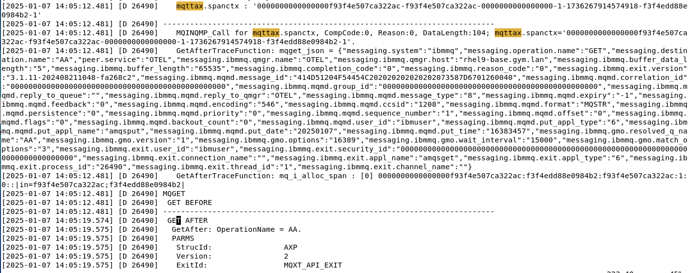

And notice that this matches the field SpanID in the Jaeger UI display. <br>

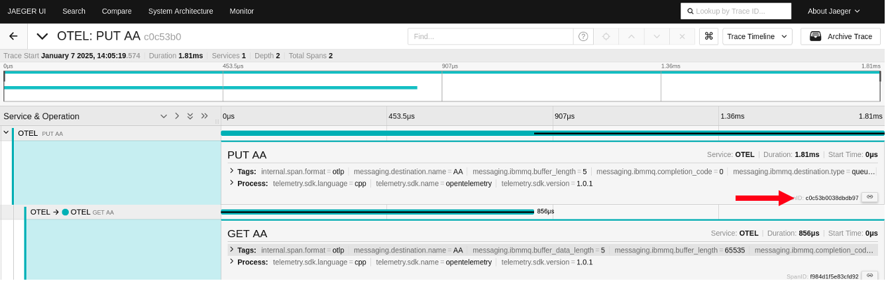

<br>

At this point , it should be clear that the MQ tracing exits have generated a spanid on both the MQPUT and the MQGET calls and then passed this information to a collector (Jaeger). <br>

Although the MQPUT and MQGET call each had their own spanid, the Jaeger UI showed them as linked. The reason is that when the MQGET call created a new span id it was also aware of the original (MQPUT) spanid and used the original span id as a ‘parent’ when passing information to the Open Telemerty Jaeger collector.
<br>

You maybe asking the question “how does the MQGET know the spanid generated by the MQPUT?”.<br>

[ The AMQSPUT and AMQSGET are in different programs running in different terminals].<br>

The span id of the MQPUT call was included in the MQ message using a property folder. This is revealed if you browse the message on queue AA. This screen shot shows an RFH2 header is used to pass the original span id from the MQPUT in the <mqttax>spanctx> section ( and remember that earlier we saw mqttax.spanctx was mentioned in the /tmp/ibmmqtrace log files).
<br>

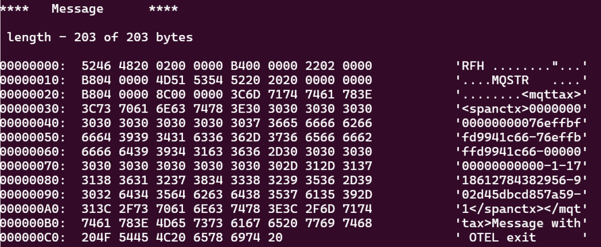

<br>

That concludes the MQ Open Telemetry tracing lab. The OTEL traces can be sent to Instana or any other Tracing platform that can accept Open Telemetry traces to monitor MQ transactions.<br>

<br>


## 8. References

MQ Open Telemetry Integration <br>
https://www.ibm.com/docs/en/ibm-mq/9.4?topic=network-opentelemetry-integration
<br>

Further information about the exit and options of the values in the configuration file at. <br>
https://www.ibm.com/docs/en/instana-observability/current?topic=mq-tracing#ibm-mq-tracing

### End ###

